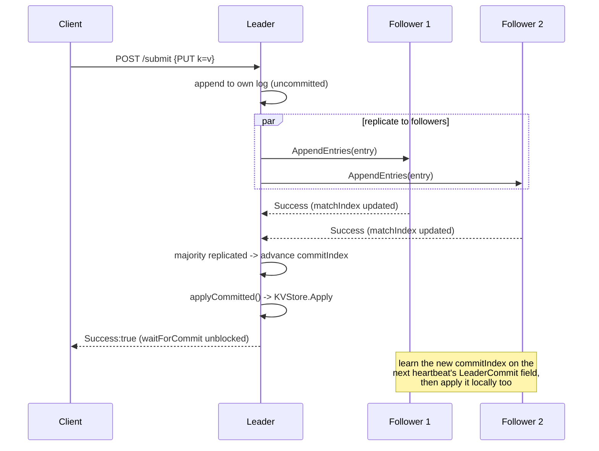
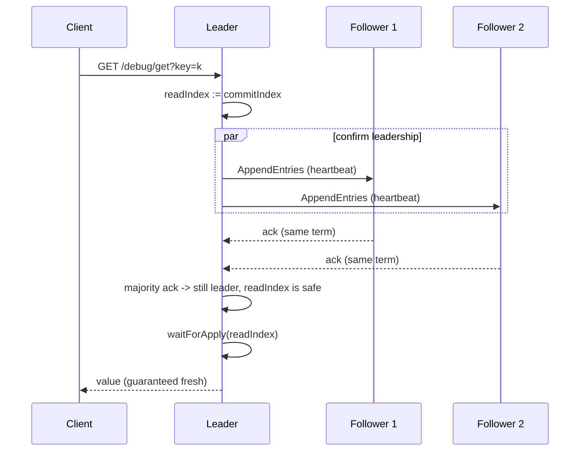

# flotilla

A distributed key-value store built on Raft consensus, implemented from
scratch in Go — no `hashicorp/raft`, no consensus library. This was a
deliberate learning project: the goal was to actually understand *why*
each safety rule in Raft exists, not just ship something that passes a
demo.

Two pieces go beyond the common "vanilla Raft KV store" tutorial and are
the actual differentiation point of this repo:

- **Log compaction / snapshotting** — a cluster that runs forever can't
  keep an unbounded log; flotilla implements snapshot-and-truncate plus
  `InstallSnapshot` for catching up peers that have fallen behind the
  truncation point.
- **Linearizable reads (ReadIndex)** — most tutorial implementations
  either skip reads entirely or serve them straight from local state,
  which is silently unsafe on a partitioned leader. flotilla implements
  the ReadIndex protocol so a read is provably as fresh as the cluster's
  most recent committed write.

## Architecture

```
cmd/flotillanode/     entrypoint — flag parsing, wires a Node to a Server, starts listening
raft/
  node.go             Node: the Raft state machine's own state (term, log, commitIndex...)
  election.go         leader election, heartbeats, commit-index advancement
  server.go           HTTP handlers — the RPC surface + client-facing /submit and /debug/get
  rpc.go              RequestVote / AppendEntries / InstallSnapshot wire types
  client.go           outbound RPC calls (what a node uses to talk to its peers)
  log.go              LogEntry / Command — the replicated unit and the KV operation it carries
  statemachine.go     KVStore — the state machine every committed entry is applied to
  persistence.go      BoltDB-backed durable storage for term/votedFor/log/snapshot
  readindex.go         confirmLeadership + waitForApply — the linearizable read protocol
scripts/
  checkpoint_c.sh     chaos test: kill the leader mid-write, verify nothing committed is lost
```

Each node is one OS process, reachable over plain HTTP+JSON (no custom
wire protocol — this project is about consensus, not transport). Every
node runs the identical state machine (`KVStore`) driven by the identical
replicated log, which is what makes them converge on the same data.

## Write / replication flow



The key correctness point baked into this diagram: **`Success:true` is
only sent after majority replication is proven**, not after the local
append. That's `waitForCommit` in `server.go` — without it, a client can
be told a write succeeded moments before the leader crashes and that
write vanishes with it. Followers, notably, don't find out an entry is
committed via the same round-trip that replicated it — they only learn
via `LeaderCommit` on a *subsequent* heartbeat, which matters for how
fast data becomes visible after a leadership change (see below).

### Reads (ReadIndex)



A read never touches the log — but a leader that only *thinks* it's
still leader (e.g. silently partitioned) must never answer from stale
local state. `confirmLeadership` proves a live majority still
acknowledges this node as leader of this term *right now*; only a real
majority ack — not `reply.Success`, which can legitimately be false for
an unrelated log-consistency reason — proves that. `waitForApply` then
ensures the local state machine has actually caught up before the read
runs.

## Failover demo (Checkpoint C)

`scripts/checkpoint_c.sh` is the portfolio demo: boots a 3-node cluster,
writes a batch of keys, **kills the leader process (`kill -9`) mid-run**,
keeps writing through the re-election window, then verifies every write
that was actually acknowledged survived on the new leader — while writes
that errored out (leader died before replying) are correctly treated as
indeterminate, not failures, since Raft only promises "acked implies
durable," never "unacked implies lost."

```
./scripts/checkpoint_c.sh
```

*(Recording of a live run: attach here.)*

## What I learned

- **Majority quorum is an availability/consistency trade, not a free
  lunch.** A 3-node cluster survives exactly one node failure and keeps
  serving; the moment you're down to a minority, the whole cluster
  correctly refuses to accept writes — not because anything is broken,
  but because there's no way to guarantee the minority isn't itself the
  partitioned-away side. Consistency wins over availability by design.
- **Linearizable reads are hard because "I'm the leader" isn't a fact, it's
  a belief with an expiration date.** A leader can be fully alive and
  fully wrong about its own status the instant it's partitioned from the
  majority. Getting reads right meant proving current leadership on every
  single read (ReadIndex), not just trusting in-memory state — the read
  path ended up needing almost as much care as the write path.
- **"Committed" and "applied" are not the same moment, and the gap is
  observable.** Even a majority-replicated entry isn't necessarily
  visible after a leadership change — Raft's safety rule only lets a new
  leader directly commit entries from its *own* current term; older
  entries ride along indirectly, only once a fresh same-term entry
  commits after them. A stuck cluster with no new writes can leave
  already-durable data un-applied indefinitely.
- **Uncommitted doesn't mean lost, and committed doesn't mean visible.**
  Whether a not-yet-committed entry survives a leader crash depends
  entirely on whether it exists on a node that the log-completeness
  voting rule allows to win the next election — sometimes it survives,
  sometimes it's cleanly overwritten, and both outcomes are correct.
- **A partition is never something the code detects directly.** There's
  no partition-aware logic anywhere in this implementation — only
  per-call success or timeout, plus an election timer. Every emergent
  behavior (failover, stale-leader rejection, redirect hints) falls out
  of that one narrow signal repeated across many independent RPCs.

## Running a local cluster

```bash
go build -o flotillanode ./cmd/flotillanode

./flotillanode -id=node1 -addr=:8001 -peers=node2=localhost:8002,node3=localhost:8003 &
./flotillanode -id=node2 -addr=:8002 -peers=node1=localhost:8001,node3=localhost:8003 &
./flotillanode -id=node3 -addr=:8003 -peers=node1=localhost:8001,node2=localhost:8002 &

curl -X POST localhost:8001/submit -d '{"Op":"PUT","Key":"x","Value":"5"}'
curl 'localhost:8001/debug/get?key=x'
```

Whichever node isn't currently leader rejects `/submit` and `/debug/get`
with a `LeaderAddr` hint pointing at the right node to retry.
